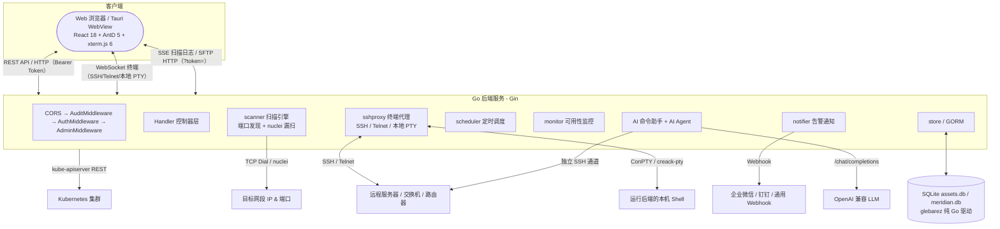
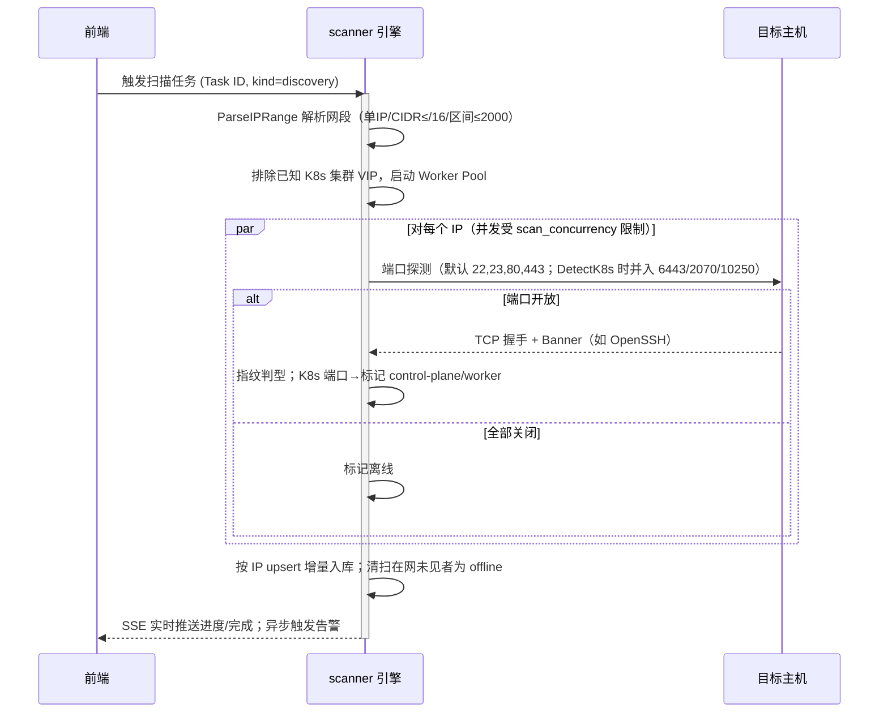
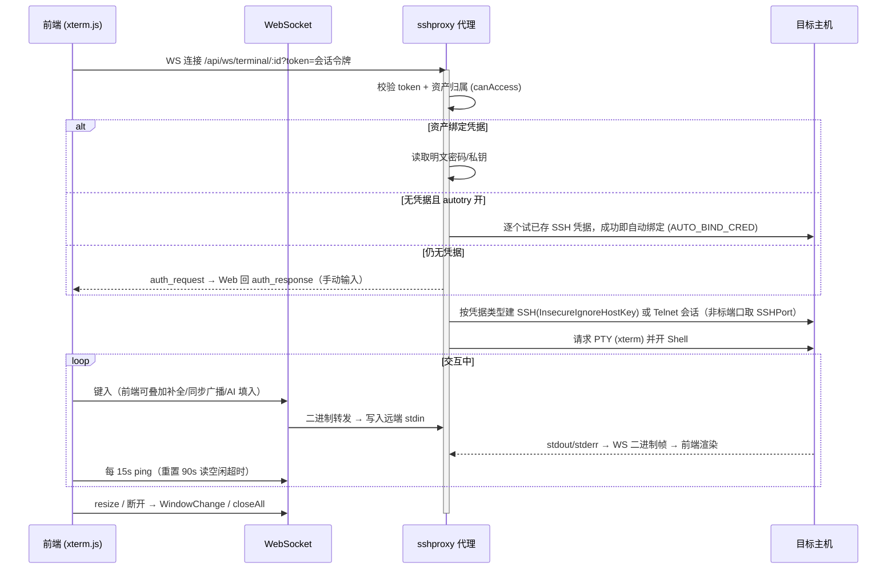

# Lynx 架构设计文档 (Architecture Design)

> **产品**：Lynx · 猞猁 — 网络资产发现与统一接入平台
> **文档版本**：v6.0（2026-06）· 对应应用版本 **v0.64**

本文档描述 Lynx 的整体技术架构、模块职责，以及关键机制（资产发现、终端代理、SSE/WebSocket/SFTP 数据流、AI Agent、Kubernetes 管理、认证与多租户）的实现逻辑。所有内容以 `backend/`、`frontend/` 现有源码为准。

> 关于历史命名：面向用户的品牌名为 **Lynx / 猞猁**（前身 Meridian / 子午，已全面更名）。底层技术标识仍沿用旧名以保证数据/兼容性，**不属于品牌名、刻意保留不改**：Tauri identifier `cn.meridian.desktop`、sidecar 二进制 `meridian-backend`、服务端二进制 `meridian-server`、环境变量 `MERIDIAN_DB` / `MERIDIAN_LOCAL_SHELL`、桌面端默认库文件名 `meridian.db`。

---

## 1. 整体架构图

系统采用前后端分离 + 单体部署：Go 后端自包含 SQLite 存储（纯 Go 驱动，免 CGO），既可作为 Web 服务端（容器/裸机 + nginx 反代），也可作为 Tauri 桌面端的本地 sidecar。

### 1.1 部署形态与端口

| 形态 | 入口 | 后端监听 | 数据库 | 本地终端 |
|------|------|----------|--------|----------|
| **Web 服务端** | nginx 反代 → 前端 dist | `LISTEN_ADDR`（容器设 `0.0.0.0:8080`） | `MERIDIAN_DB`，默认 `assets.db` | 默认关闭（绑 `0.0.0.0` 时不暴露宿主 Shell） |
| **桌面端 (Tauri v2)** | 原生窗口 + WebView | sidecar `127.0.0.1:8765` | 用户数据目录下 `meridian.db` | 默认开启（`MERIDIAN_LOCAL_SHELL=1`） |
| **前端 dev** | `http://localhost:5173`（Vite） | 代理 `/api` → `127.0.0.1:8080`（含 WS） | — | — |

后端默认仅监听 `127.0.0.1:8080`，由环境变量 `LISTEN_ADDR` 覆盖。启动日志横幅：`Lynx · 猞猁 — 网络资产发现与统一接入平台`。

---

## 2. 技术栈

### 2.1 后端
- **Go 1.22**；Web 框架 **Gin 1.10**；ORM **GORM 1.25**。
- 数据库驱动 **glebarez/sqlite 1.11**（基于 modernc 的**纯 Go SQLite**，**无需 cgo / gcc**，跨平台单二进制）。
- WebSocket：gorilla/websocket；SSH：golang.org/x/crypto/ssh；SFTP：pkg/sftp。
- 本地 PTY：Unix/macOS 用 creack/pty（纯 Go）、Windows 用 UserExistsError/conpty（ConPTY，需 Win10 1809+）。
- 漏扫：外部 `nuclei` 二进制（`exec.LookPath` 查找，`-jsonl` 输出解析）。

### 2.2 前端
- **React 18** + TypeScript + **Vite 8** + **Ant Design 5** + **react-router-dom 7**（BrowserRouter）+ axios。
- 终端：**@xterm/xterm 6** + addon-fit + addon-search。
- 脚本：`dev`=vite、`build`=`tsc -b && vite build`、`desktop:dev`=tauri dev、`desktop:build`=tauri build。
- 未启用 `StrictMode`（避免 xterm / WebSocket 双挂载导致的重连竞态）；页面按路由 `React.lazy` 懒加载，重型依赖 xterm.js 不进首屏主包。

### 2.3 桌面端
- **Tauri v2（Rust）+ Go sidecar**：外部二进制 `binaries/meridian-backend` 由 Tauri 启动。
- productName=`Lynx`，window title=`Lynx · 猞猁`，identifier=`cn.meridian.desktop`，version=`0.64.0`，CSP=`null`。
- Tauri 插件：`shell`（启动 sidecar、外链走系统浏览器）、`clipboard-manager`（系统剪贴板）。
- sidecar 注入环境：`LISTEN_ADDR=127.0.0.1:8765`、`MERIDIAN_DB`（应用数据目录下 `meridian.db`）、`MERIDIAN_LOCAL_SHELL=1`、`TZ=Asia/Shanghai`；窗口销毁时 kill 子进程。
- **桌面端免登录**：前端后台自动用默认管理员凭据登录（依次尝试 `admin/admin`、`admin/123456`，每次 8s 超时、最多 40 轮重试），全部失败才落登录页。

---

## 3. 模块职责说明

### 3.1 前端（`frontend/src`）

#### 应用骨架 `App.tsx`
- 左侧可折叠暗色侧边栏（224↔76px）：Logo、`QuickConnect`（按标签分组的主机树 + 本地终端）、导航菜单、GitHub/版本页脚。
- **路由表**（管理员限定项标 [A]）：`/`→Dashboard、`/assets`→Assets、`/k8s`→K8sClusters、`/tasks`→ScanTasks [A]、`/vulns`→Vulns [A]（无侧栏入口，经全局搜索/跳转到达）、`/credentials`→Credentials、`/users`→Users [A]、`/audit`→Audit [A]、`/settings`→Settings [A]、`*`→重定向 `/`。
- **鉴权门禁**：`mrd-auth==='1'`（或桌面自动登录）判定登录态，否则渲染 `Login`；`mrd-must-change==='1'` 渲染 `ForcePasswordChange` 并阻断全应用（Web 端首登/被重置）；管理员可见性由 `mrd-role==='admin'` 控制，对四个 [A] 路由与 `/vulns` 做条件渲染。
- **独立终端视图**：URL 以 `/terminal/` 开头时渲染全屏 `TerminalPage`（独立 `TerminalProvider`）。
- 终端会话**常驻挂载**（仅显示活动会话），切到终端时路由页 `display:none` 保活；监听 `mrd-open-sftp`/`mrd-navigate` 窗口事件。

#### 页面 `pages/*`
- **Dashboard**：资产分类/在线率/类型分布/最近活动时间线，定时轮询（数据按当前用户归属隔离）。
- **Assets（CMDB）**：手动录入/编辑、CSV 导入/导出、在线探测、认证采集（架构/虚拟化）、标签、一键调起终端、字段级变更历史、管理员分配归属、可用性/在线率、SFTP 抽屉。
- **ScanTasks（自动发现）**：配置网段/端口/扫描类型/定时，启停扫描，SSE 实时日志与历史回看 [A]。
- **Vulns**：nuclei 漏扫结果列表（严重程度着色）[A]。
- **Credentials（凭据保管箱）**：SSH 密码/密钥/Telnet 录入 + 连通性测试（按归属隔离）。
- **Users / Audit**：用户增删改、角色/状态（审批 pending→active）、改密 [A]；操作审计查询 [A]。
- **Settings**：扫描并发/超时、SSH 超时、可用性监控、告警通知、AI 配置（OpenAI 兼容）[A]。
- **K8sClusters**：扫描发现的 K8s 节点归类、`/etc/hosts` 自动分类、跳控制台、实时看板（节点/Pod/版本）。
- **TerminalPage**：多分屏 xterm 终端中心（见 §5.4）；既作 `/terminal/:id` 独立标签，也内嵌于应用内标签。
- **Login / ForcePasswordChange**：登录 + 开放注册（注册账号需管理员审批）；首登强制改密（旧密码留空，后端在此流程跳过旧密码校验）。

#### 组件 `components/*`
`PageHeader`（页头）、`GlobalSearch`（Ctrl/Cmd+K 检索资产与页面）、`SnippetManager`（命令片段 CRUD）、`SftpDrawer`（SFTP 文件浏览抽屉）、`QuickConnect`（主机树/拖拽到分屏/右键菜单）、`UserMenu`（改密/登出）、`CommandPalette`（Ctrl/Cmd+Shift+P 命令面板）、`ShortcutHelp`（快捷键速查）、`Logo`（猞猁头 SVG）、`TerminalAIPanel`（终端右下角悬浮 AI 助手）、`TerminalTabBar`（标签条：拖拽排序/重命名/换色/活动提示）。

#### 状态与服务
- **`terminalSessions.tsx`**：终端会话 Context（`TerminalProvider`/`useTerminals`）。管理标签集合、活动标签、活动提示点、拖拽排序、标签名/颜色持久化（`localStorage`）；**命令同步广播**：维护已连接物理 WebSocket 句柄注册表，`broadcastGlobalData` 把输入广播到同步集合内的所有面板/标签（"一处键入、处处执行"）。
- **`services/api.ts`**：`isTauri` 检测；axios `baseURL = ${BACKEND_ORIGIN}/api`（桌面=`http://127.0.0.1:8765`，Web=同源）；请求拦截注入 `Authorization: Bearer <mrd-token>`（桌面端首屏等待后台登录拿到 token 再发非登录请求）；响应拦截解包 `code===200`、`code===401` 时清会话并刷新（桌面端静默）；WS/SSE 无法设请求头，token 走 `?token=` 查询参数（`getTerminalWsUrl`/`getLocalTerminalWsUrl`，本地 Shell 用 `LOCAL_ASSET_ID=-1`）。
- **`commandSnippets.ts`**：约 **260** 条内置运维命令片段库（文件/文本/进程/网络/systemd/Docker/K8s/Git/防火墙等），用法频率学习重排序，`localStorage` 持久化。
- **`theme.ts`**（设计令牌：靛蓝→紫→青品牌渐变 + 深空暗色侧栏 + AntD ConfigProvider 令牌）、**`clipboard.ts`**（桌面走 Tauri 剪贴板、Web 走 execCommand+Clipboard API）、**`main.tsx`**（入口，吞掉 ResizeObserver 噪声错误，`createRoot` 渲染，无 StrictMode）。

### 3.2 后端（`backend/internal`）

#### 入口与中间件 `cmd/server/main.go`
启动顺序：`store.InitDB()` → `scheduler.Start(db)` → `monitor.Start(db)` → Gin 引擎。中间件链（外到内）：全局 **CORS** → **AuditMiddleware**（最外层，审计含登录/注册在内的所有写操作）→ 公开 `login`/`register` → **AuthMiddleware**（其后全部需登录）→ 个别路由叠加 **AdminMiddleware** 角色校验。

#### 认证与多租户 `handler/auth.go`
- 登录用 `bcrypt` 校验，签发 32 字节随机会话 token（**进程内存表**，TTL 7 天，重启即失效需重登）；token 取自 `Authorization: Bearer` 或 `?token=`（供 WS/SSE/SFTP 下载）；上下文注入 `user_id`/`username`/`role`。
- 登录失败 **5 次锁定 10 分钟**（内存计数）。
- `canAccess(ownerID)` = `isAdmin || ownerID == 当前用户`：资产/凭据/K8s 集群按 `owner_id` 隔离，普通用户仅见/操作自己的记录。`assertCredentialOwned` 防止把资产/集群绑定到他人的 `credential_id` 而窃用其凭据（跨租户凭据盗用防护）。

#### 用户与审计 `handler/users.go`、`handler/audit.go`
注册默认 `pending` 需管理员审批；用户 CRUD、角色（admin/user）与状态（active/disabled/pending）、改密；保护"最后一个管理员"不被删/禁；改密/禁用即吊销该用户全部会话。`AuditMiddleware` 捕获写操作（actor/action/path/业务码/IP），SFTP 与 AI 另做细粒度审计。

#### 资产与采集 `handler/handlers.go`、`handler/assets_io.go`、`handler/uptime.go`
资产 CRUD（IP 范围批量、字段级历史）、CSV 导入（中英文表头别名、按 IP upsert）、TCP 在线探测（单/批量）、认证采集（SSH 执行 `uname` + `systemd-detect-virt` 写入 `arch`/`virtualization`）、可用性历史与在线率（`GetAssetUptime`）。`GetCapabilities` 暴露 `local_shell` 能力开关。

#### 扫描引擎 `scanner/`
- `engine.go`：定义 `ScanEngine` 接口与统一入口 `StartScanTask`，按 `Kind` 分发——`vuln`→nuclei 漏扫，其它/默认→端口发现；顶层 `recover()` 捕获 panic，将任务与最近 `running` 日志标记为 `failed`，避免卡在 running。
- `scanner.go`（端口发现）：读 `scan_concurrency`（默认 100，1–1000）与 `scan_timeout`（默认 2s）；IP 工作池 + 每主机 50 端口子池（防 FD/协程爆炸）；`activeScans` map 注册 `context.CancelFunc` 支持中途停止；>1000 IP 限速 200 IP/s；排除已知 K8s 集群 VIP；代理/VPN 端口劫持检测（对疑似劫持端口做 SSH/Telnet/TLS/HTTP 深度握手核验，避免误判在线）；Banner/HTTP `Server` 头指纹判型；按 IP upsert 增量入库 + 在网未见者清扫为 `offline`；任务收尾异步触发告警。
- K8s 探测（`DetectK8s` 开启时并入 6443/2070/10250）：apiserver 端口（TLS 证书 SAN/CN 命中 `kubernetes*` 或 `/version`）→ `control-plane`；kubelet 10250（`/healthz`）→ `worker`。
- `nuclei.go`（漏扫）：`exec.LookPath` 找 `nuclei`（缺失则带安装提示优雅失败），逐目标 `nuclei -target <ip> -jsonl -silent -duc -timeout 10`，JSONL 逐行解析为 `VulnFinding`（按 IP 关联 CMDB 资产，否则 AssetID=0），尊重中途取消。
- `ip_range.go`：展开单 IP / CIDR / `a-b` 区间（区间最多 2000、CIDR 上限 /16）。

#### 定时调度 `scheduler/scheduler.go`
自包含轮询，无外部 cron 依赖：单协程每 30s 触发到点任务；语法 `""`（手动）/`@every <dur>`（最小 1 分钟）/`daily:HH:MM`；状态内存态（防重启风暴：新任务首见不触发；`daily` 同分钟内去重；`running` 任务跳过）。

#### 可用性监控 `monitor/monitor.go`
单协程每 30s tick，是否探测由 `monitor_enabled` 控制、节奏由 `monitor_interval`（分钟，默认 5）决定；并发信号量上限 50、写库串行（避免 SQLite 写锁争用）；任一端口（22/23/80/443/8080/3389）2s 内可连即"在线"；记 `AssetCheck` 历史，仅在线↔离线翻转时触发告警；清理 30 天前历史。

#### 告警通知 `notifier/notifier.go`
渠道 **企业微信（markdown）/ 钉钉（text）/ 通用 Webhook（JSON）**，配置读自 `SystemSetting`，8s HTTP 超时；入口 `ScanFinished`（`notify_on_scan` 门控）、`AssetStatusChanged`（`notify_on_offline` 门控）、`SendTest`（UI 测试）；调用方均在 goroutine 中触发，通知失败不阻塞主流程。

#### 终端 / 文件代理 `sshproxy/`、`handler/sftp.go`
- `ConnectTerminal` 校验归属后升级 WebSocket，按凭据类型路由：telnet→`ProxyTelnet`，否则→`ProxyTerminal`。资产无凭据且 `?autotry`≠0（默认开）时，`autoTryBindCredential` 逐个试当前用户已存 SSH 凭据，首个拨号成功者自动绑定到资产并审计 `AUTO_BIND_CRED`，全失败则回退 `ProxyTerminal` 内的手动输入流程。
- `sshproxy.go`（`ProxyTerminal`）：`golang.org/x/crypto/ssh` 建连（`InsecureIgnoreHostKey`，10s 连接超时，非标端口取 `asset.ResolvedSSHPort()`），分配 `xterm` PTY、强制远端 UTF-8、开 Shell；两协程泵 stdout/stderr→WS 二进制帧，主循环泵 WS→stdin 并处理 `resize`（`WindowChange`）/`ping`（`pong`）。
- `telnet.go`（`ProxyTelnet`）：WebSocket↔Telnet（23，10s 拨号），最小化 IAC 协商（拒绝所有选项、跳子协商、去转义），无窗口尺寸故忽略 resize。
- `local.go` + `localpty_windows.go`/`localpty_unix.go`（`ProxyLocal`）：本机 Shell 本地终端。Windows 走 ConPTY 启 `powershell.exe`（回退 `cmd.exe`），Unix 走 creack/pty 启 `$SHELL`（登录 Shell，`TERM=xterm-256color`），均以用户家目录为工作目录。
- **半开连接保护**：所有终端代理共用 `wsReadIdleTimeout = 90s` 读空闲超时；前端每 15s 发心跳 ping，90s 无任何帧到达即由 `ReadMessage` 报错触发 `closeAll`，释放 SSH/PTY 与协程。
- `sftp.go`：基于 pkg/sftp，与终端同一 SSH 拨号路径，提供 list/download（流式）/upload（≤2 GiB）/mkdir/remove（目录递归）/rename；仅 SSH 凭据可用（Telnet 拒绝），归属校验，**全程审计**（成功/失败/越权都记，下载文件名做头注入消毒）。

#### AI 命令助手与 AI Agent `handler/ai.go`、`handler/ai_agent.go`
- **AI 命令助手**：自然语言 → 单条 shell 命令，**仅生成不执行**，前端二次确认。门控 `ai_enabled` + `ai_base_url`/`ai_api_key`/`ai_model`，调 OpenAI 兼容 `/chat/completions`（temperature 0.2、max_tokens 400、30s 超时、Bearer 鉴权）；`dangerousCmdPatterns` 正则集识别高危命令（`rm -rf`、`mkfs`、`dd of=/dev`、fork 炸弹、`shutdown/reboot`、`curl|sh`、写 `/etc/passwd|shadow|sudoers` 等）标记给前端；归属校验 + 审计（`AI_CMD`）。`base_url` 可指向自建/本地 LLM。
- **AI Agent**：一句话多步自动执行。观察→决策→执行循环：LLM 返回结构化 JSON 动作（thought/command/done/summary），后端经**独立 SSH 通道**逐条执行——每命令新开 `client.NewSession()`，包一层 `cd` 到持久化 `WorkDir` 并打印 `__MRD_CWD__:` pwd 标记（工作目录跨命令保留，环境变量不保留），回传退出码与输出推进模型。命中高危命令暂停为 `awaiting_confirm`（`Pending` 暂存命令，`ContinueAgent` 批准/拒绝）；仅 SSH（Telnet 拒绝）、需绑定凭据、归属校验。限额：最多 **15 步**、每命令 **30s** 超时、会话空闲 **1h**、模型调用 60s 超时、输出截断（回模型 3000 / 回前端 6000）；会话内存表 + **写穿持久化到 `AgentSession` 表**（重启不丢、可恢复/查看），`StopAgent` 可中断在途 LLM/SSH，全程审计（`AI_AGENT*`）。

#### Kubernetes 管理 `handler/k8s.go`
集群是手动归类单元（VIP + 控制台端口/路径 + 绑定凭据 + 可选 API Token），节点复用 `Asset`（经 `Asset.K8sClusterID` 归属），`owner_id` 隔离 + 全程审计。`probeClusterOnline` TCP 探 VIP:console_port（1.5s）。**实时看板**（Phase 3）：`kubeGet` 在服务端用集群 ServiceAccount Bearer Token 认证 GET kube-apiserver（`InsecureSkipVerify`、8s 超时、4MB 上限，**token 不出后端**）——`/api/v1/nodes`、`/api/v1/pods`、概览（就绪/总节点、运行/总 Pod、版本）。`GetK8sConsole` 返回控制台 URL + 凭据（审计 `K8S_CONSOLE`，跨租户凭据守卫）。`AutoClassifyK8s` SSH 读节点 `/etc/hosts` 的 `cluster-vip` 标记，按 owner+VIP 归并到已有/新建集群。

#### 数据持久化 `store/db.go`
GORM + **glebarez/sqlite（纯 Go、免 cgo）**；库路径由 `MERIDIAN_DB` 指定（默认 `assets.db`，目录自动创建，`busy_timeout=5000`）。启动 `AutoMigrate` 全部 14 个模型、播种默认设置与默认管理员（`admin/admin` + 首登强制改密）。

---

## 4. 核心流程

### 4.1 资产自动发现流程

### 4.2 终端代理流程（SSH / Telnet / 本地）

> 本地终端走 `/api/ws/local-terminal`，由 `LocalShellEnabled()` 门控（`MERIDIAN_LOCAL_SHELL=1` 或后端监听回环地址时开），后端经 ConPTY/creack-pty 桥接本机 Shell，协议与上图一致。命令补全、命令同步、AI 填入均为**前端能力**，后端终端代理保持透明。

---

## 5. 关键机制专题

### 5.1 SSE 实时扫描日志
扫描日志经 **Server-Sent Events** 单向推流：`GET /api/tasks/:id/stream`（[A]，token 走 `?token=`）服务端每秒轮询 `ScanLog.Detail` 增量并 flush，前端 `EventSource` 实时追加，`done` 事件收尾后拉取完整历史。选 SSE 而非 WS：进度是单向服务端推流、无需客户端回写，SSE 自带断线重连且浏览器原生支持。

### 5.2 命令同步广播
前端在 `terminalSessions.tsx` 维护已连接物理 WS 句柄注册表，工具栏"同步所有 (N)"开启后，`broadcastGlobalData` 把源面板输入广播到同步集合内所有面板/标签，实现"一处键入、处处执行"。

### 5.3 命令补全与片段库
约 260 条内置运维命令片段（`commandSnippets.ts`），按关键字/前缀/缩写/模糊子序列 + 用法频率/时近性评分，内联补全展示前 8 条（命令面板最多 50/60）；用户片段经 `SnippetManager` CRUD，`localStorage` 持久化。

### 5.4 多分屏终端
`TerminalPage.tsx` 最多 **4 面板**（`MAX_PANES=4`），预设 `single` / `h-split`（左右双分）/ `quad`（田字四分），分隔条可拖拽缩放（每侧最小 12%），单面板可临时最大化。**7 套终端配色**（Lynx 深空/VS Code 暗/Dracula/Monokai/Solarized 暗/Solarized 亮/GitHub 亮），scrollback 5000 行。**重连回放缓冲 512KB**（FIFO 丢弃最旧块），重连后回放恢复输出，指数退避自动重连。另支持每面板 SFTP 拖拽上传、UTF-8/GBK 编码切换、字号缩放（Ctrl+滚轮/Ctrl±）、可点击链接、延迟 ping/pong 显示——状态均经 `localStorage`（`term_*`）持久化。

---

## 6. 安全性与容错

### 6.1 已实现
1. **会话鉴权**：`POST /api/login` 校验 bcrypt 并签发 token；受保护路由经 `AuthMiddleware`，管理员路由经 `AdminMiddleware`（WS/SSE/SFTP 下载用 `?token=`）。
2. **多租户数据隔离**：资产/凭据/终端/SFTP/在线探测/活动/K8s 集群按 `owner_id` 隔离（`canAccess`）；`assertCredentialOwned` 防跨租户凭据盗用。
3. **注册审批与口令安全**：开放注册但默认 `pending` 需审批；登录失败 5 次锁 10 分钟；默认 `admin/admin` 首登强制改密；改密/禁用即吊销该用户全部会话。
4. **全量审计**：所有写操作（含 SFTP/AI 细粒度）记入 `AuditLog`。
5. **扫描健壮性**：探测带超时、并发受限、大网段限流；扫描在独立 goroutine `panic` 恢复，崩溃只标记任务失败而不拖垮服务。
6. **终端异常处理**：90s 读空闲超时 + `sync.Once` `closeAll` 对称释放 WS/SSH/Telnet/PTY，避免孤儿会话。
7. **本地终端隔离**：多用户服务器（绑 `0.0.0.0`）默认关闭本地终端，避免把宿主 Shell 暴露给任意登录用户。

### 6.2 有意延后的设计取舍（本地/内网工具定位，**非缺陷**）
> 自动化审计会反复将其标为高危；在用户明确要求加固前不擅自重写。
1. **凭据明文存储**：密码/私钥以明文存于 SQLite（界面已显式说明）。按当前定位刻意为之；生产加固方向为 AES-at-rest + KMS。
2. **SSH 主机密钥不校验**：终端/SFTP/采集/测试/Agent 统一 `ssh.InsecureIgnoreHostKey()`；K8s 实时看板用 `InsecureSkipVerify`。为内网即插即用刻意取舍；后续可接 known_hosts / CA 校验。
3. **默认凭据 `admin/admin`**：首登强制改密兜底；桌面端据此实现免登录自动登录。
4. **会话存于进程内存**：重启后 token 失效需重登；如需高可用可外置（Redis 等）。

---

## 7. 数据模型总览（共 14 表）

启动统一 `AutoMigrate`（`store/db.go`），模型定义见 `model/models.go`。

| 模型 | 表名 | 主要字段 | 说明 |
|------|------|----------|------|
| User | users | id, username(唯一), password(bcrypt,不导出), role(admin/user), status(active/disabled/pending), must_change_password, last_login_at, last_login_ip | 多用户/审批/锁定 |
| AuditLog | audit_logs | id, actor, action, path, status, ip, created_at | 写操作审计 |
| AssetCheck | asset_checks | id, asset_id, status, checked_at | 可用性探测历史（uptime） |
| Asset | assets | id, **owner_id**, name, ip(唯一), type, status, **ssh_port**, vendor, os_version, **arch**, **virtualization**, ports, tags, description, credential_id, **k8s_role**, **k8s_cluster_id**, last_scanned_at | 归属隔离 + 非标端口 + K8s 归类 |
| Credential | credentials | id, **owner_id**, name, type(ssh_password/ssh_key/telnet), username, password(明文), private_key(明文) | 归属隔离 |
| ScanTask | scan_tasks | id, name, target_range, ports, kind(discovery/vuln), **detect_k8s**, schedule, status, last_run_at | 发现/漏扫 + K8s 探测 + 调度 |
| ScanLog | scan_logs | id, task_id, status, started_at, finished_at, summary, detail | SSE 流来源 |
| ActivityLog | activity_logs | id, type, message, ref_id, created_at | 活动时间线 |
| SystemSetting | system_settings | key, value, updated_at | 扫描/监控/通知/AI/默认账号 |
| VulnFinding | vuln_findings | id, asset_id, target, template_id, name, severity, matched_at, engine(nuclei) | nuclei 漏扫结果 |
| AssetHistory | asset_histories | id, asset_id, field, old_value, new_value, created_at | 字段级变更 |
| Tag | tags | id, name(唯一), color | 全局标签 |
| AgentSession | agent_sessions | id, requester_id, asset_id, asset_name, title, os_hint, work_dir, messages(JSON), steps(JSON), status, pending, pending_note, summary | AI Agent 会话持久化（重启不丢 + 历史对话） |
| K8sCluster | k8s_clusters | id, **owner_id**, name, vip, console_port, console_path, api_server, api_token(不导出), credential_id, description | 集群归类单元（节点复用 Asset） |

> `arch`/`virtualization` 由认证采集写入；`kind` 区分端口发现与漏扫，`detect_k8s` 触发 K8s 端口探测；`k8s_role`/`k8s_cluster_id` 由扫描与归类写入；`owner_id` 驱动多租户隔离；`ssh_port` 支持非标端口；`agent_sessions` 写穿持久化供历史对话切换；K8sCluster 的 `api_token` 仅服务端使用、不回传前端。

### 系统设置默认键（节选）
`scan_concurrency=100` · `scan_timeout=2` · `ssh_timeout=10` · `auth_username=admin` · `auth_password=admin` · `monitor_enabled=false` · `monitor_interval=5` · `notify_type=none` · `notify_url=` · `notify_on_scan=true` · `notify_on_offline=true` · `ai_enabled=false` · `ai_base_url=` · `ai_api_key=` · `ai_model=`

---

## 8. API 路由全集

前缀 `/api`；除 `login`/`register` 外均需登录；标 **[A]** 为仅管理员。

- **认证/用户**：`POST /login`、`POST /register`、`POST /logout`、`POST /users/change-password`；[A] `GET/POST /users`、`PUT/DELETE /users/:id`；[A] `GET /audit`
- **仪表盘/活动/能力**：`GET /dashboard/stats`、`GET /activity/recent`、`GET /capabilities`
- **凭据**：`GET/POST /credentials`、`PUT/DELETE /credentials/:id`、`POST /credentials/:id/test`
- **设置/通知**：[A] `GET/PUT /settings`、[A] `POST /notify/test`
- **AI**：`GET /ai/status`、`POST /ai/command`、[A] `POST /ai/test`；`POST /ai/agent/start|continue|message|stop`、`GET /ai/agent/sessions`、`GET /ai/agent/sessions/:id`
- **K8s**：`GET/POST /k8s/clusters`、`GET/PUT/DELETE /k8s/clusters/:id`、`POST /k8s/clusters/:id/nodes`、`DELETE /k8s/clusters/:id/nodes/:assetId`、`GET /k8s/clusters/:id/console`、`GET /k8s/nodes/unassigned`、`POST /k8s/auto-classify`、`GET /k8s/clusters/:id/overview|live/nodes|live/pods`
- **资产**：`GET /assets`、`POST /assets/import`(CSV)、`GET /assets/:id`、`POST /assets`、`PUT/DELETE /assets/:id`、`POST /assets/:id/ping`、`POST /assets/batch-ping`、`GET /assets/:id/uptime`、`POST /assets/:id/collect`、`GET /assets/:id/history`
- **扫描任务** [A]：`GET/POST /tasks`、`PUT/DELETE /tasks/:id`、`POST /tasks/:id/run|stop`、`GET /tasks/:id/logs`、`GET /tasks/:id/stream`(SSE)
- **漏洞** [A]：`GET /vulns`
- **SFTP**：`GET /assets/:id/sftp/list|download`、`POST /assets/:id/sftp/upload|mkdir|remove|rename`
- **标签**：`GET/POST /tags`、`PUT/DELETE /tags/:id`
- **WebSocket**：`GET /ws/terminal/:id`（SSH/Telnet）、`GET /ws/local-terminal`（本机 Shell）

---

## 9. 核心功能小结
- **资产发现扫描**：端口扫描（单 IP / CIDR≤/16 / 区间≤2000）、有界端口探测工作池、指纹判型、排除 K8s VIP、可选 nuclei 漏扫、定时调度、SSE 实时日志。
- **统一终端接入**：SSH / Telnet + 本机 Shell；多分屏（≤4）、可拖拽排序标签、命令补全、命令面板、命令片段库、SFTP 拖拽上传、命令同步广播、指数退避自动重连、终端内搜索、字号缩放、配色主题、快捷键速查；90s 半开连接保护。
- **凭据管理**：SSH 密码/私钥、Telnet；归属隔离；连通性测试；终端连接时自动绑定可用凭据。
- **K8s 集群管理**：节点归类（手动/`/etc/hosts` 自动）、VIP 探测、实时看板（节点/Pod/版本，需 API Token）、控制台入口。
- **AI 命令助手 + Agent**：自然语言转命令（仅生成、前端确认）；一句话多步自动执行（独立 SSH 通道、高危拦截、多轮上下文、持久化历史）；OpenAI 兼容、可指向本地 LLM。
- **运维周边**：定时扫描、可用性监控、告警通知（企业微信/钉钉/Webhook）、审计日志、多用户多租户、CSV 资产导入、标签体系、仪表盘。
